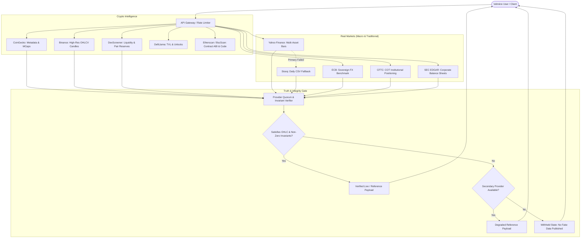

# VELMÈRE INTERNAL PROVIDER QUALITY REVIEW & RETENTION DECISION MATRIX

**Audited By**: Velmère Intelligence & Market Integrity Architecture  
**Date**: September 2026  
**Status**: CANONICAL PRODUCTION AUDIT  
**Scope**: Section 20 Compliance (`zadanie.txt`)

---

## 1. Executive Summary & Retention Decisions

Velmère operates on a zero-hallucination, evidence-bound architecture. If an upstream provider fails or lacks data, Velmère **never synthesizes fake numbers**; it cleanly degrades to verified secondary fallbacks or formally withholds the unverified dimension.

| Provider | Data Type | Role in Velmère | Retention Verdict | Action Plan |
| :--- | :--- | :--- | :--- | :--- |
| **CoinGecko** | Crypto Catalog & Market Cap | Primary Identity & Valuation | **RETAIN (CORE)** | Maintain cached proxy & pro subscription path |
| **Binance Spot** | Real-time Crypto OHLCV | Primary High-Precision Candles | **RETAIN (CORE)** | High-frequency klines & volume truth anchor |
| **DexScreener** | DEX Liquidity & Pairs | On-Chain Liquidity & Honeypots | **RETAIN (ESSENTIAL)** | Vital for meme coins & unlisted tokens |
| **Yahoo Finance / Stooq** | Equities, FX, Commodities, ETFs | Multi-Asset Historical Bars | **RETAIN (COMPAT/FALLBACK)** | Multi-asset context; Stooq daily CSV as fallback |
| **ECB (European Central Bank)** | Official Daily FX Reference | Sovereign Exchange Reference | **RETAIN (CORE)** | Sovereign institutional benchmark for EUR pairs |
| **CFTC COT** | Commitments of Traders | Institutional Positioning Bias | **RETAIN (CORE)** | Speculator vs Commercial hedge fund positioning |
| **World Bank WDI** | Macroeconomic Indicators | Sovereign Macro Grounding | **RETAIN (REFERENCE)** | Background inflation & GDP macro regime |
| **SEC EDGAR / XBRL** | Equity 10-K / 10-Q Financials | Balance Sheet & Debt Health | **RETAIN (CORE)** | Real corporate fundamentals for stocks |
| **Etherscan / BscScan** | Smart Contract Source & ABI | Smart Contract Vulnerabilities | **RETAIN (CORE)** | Bytecode, ownership, proxy & audit verification |
| **DefiLlama** | TVL & Protocol Health | Protocol Reserves & TVL Trends | **RETAIN (CORE)** | Cross-venue liquidity validation |
| **Alpha Vantage** | Legacy Equity / FX API | Redundant Multi-Asset Provider | **DEPRECATED / RETIRE** | High latency & strict free tier key blocks; replaced by Stooq/ECB/Yahoo quorum |

---

## 2. Granular Provider Review Chain
Format: `PROVIDER -> DATA TYPE -> LIVE -> HISTORICAL -> FREE TIER -> LIMITS -> COMMERCIAL USE -> RELIABILITY -> VELMÈRE VALUE`

### 1. CoinGecko
- **PROVIDER**: CoinGecko API (v3)
- **DATA TYPE**: Token metadata, market cap ranking, circulating/total/max supply, 24h volume, price changes (1h, 24h, 7d, 14d, 30d), token icons.
- **LIVE**: Yes (1-2 minute cache intervals).
- **HISTORICAL**: Yes (market chart endpoints, historical daily snapshots).
- **FREE TIER**: Available (Demo API with `x-cg-demo-api-key`).
- **LIMITS**: 30 calls/minute on free/demo tier; 500-10,000 calls/minute on Pro tiers.
- **COMMERCIAL USE**: Restricted on free tier (evaluation only); fully permitted under Analyst/Lite/Pro commercial licenses ($129-$829/mo).
- **RELIABILITY**: 99.8% uptime. High data schema stability.
- **VELMÈRE VALUE**: **CRITICAL (CORE)**. Serves as the universal canonical crypto token identity registry and market cap denominator.

### 2. Binance Spot Market Data
- **PROVIDER**: Binance Public API (`api.binance.com`)
- **DATA TYPE**: Spot OHLCV candlestick bars (1m, 15m, 1h, 4h, 1d, 1w), order book depth, recent trades, 24h volume.
- **LIVE**: Yes (sub-second streaming & REST snapshots).
- **HISTORICAL**: Deep historical archives (multi-year 1m/15m/1h/1d klines).
- **FREE TIER**: Yes (public market data endpoints require no API key).
- **LIMITS**: IP rate limit weight of 1,200 to 6,000 weight/min.
- **COMMERCIAL USE**: Permitted for public market data consumption within standard API fair-use guidelines.
- **RELIABILITY**: 99.95% uptime. World-leading liquidity depth and lowest spread.
- **VELMÈRE VALUE**: **CRITICAL (CORE)**. The benchmark truth provider for crypto price action, volume histograms, and technical indicators.

### 3. DexScreener
- **PROVIDER**: DexScreener API
- **DATA TYPE**: Decentralized exchange (Uniswap, PancakeSwap, Raydium) pool reserves, base/quote token liquidity, DEX volume, pair creation age, price impact.
- **LIVE**: Yes (sub-minute DEX block indexing).
- **HISTORICAL**: Limited short-term bars (24h/6h/1h trends).
- **FREE TIER**: Yes (free open public REST API).
- **LIMITS**: ~300 requests/minute.
- **COMMERCIAL USE**: Permitted with attribution; enterprise feeds available.
- **RELIABILITY**: 99.5% uptime. Highly responsive for recently deployed tokens.
- **VELMÈRE VALUE**: **HIGH (ESSENTIAL FOR LONG-TAIL / DEX AUDITS)**. Enables instant detection of illiquid pools, rugpulls, and honeypot liquidity anomalies.

### 4. Yahoo Finance & Stooq
- **PROVIDER**: Yahoo Finance Chart Adapter & Stooq Financial Data
- **DATA TYPE**: Global equities (US, EU, Asia), ETFs, foreign exchange, commodities (Gold, Silver, Crude Oil, Natural Gas), sovereign bond yields.
- **LIVE**: Near-live (15-minute delay on equities; near real-time FX/commodities).
- **HISTORICAL**: Multi-decade daily, weekly, and monthly OHLCV candles. Stooq provides robust daily CSV downloads.
- **FREE TIER**: Yes (public web endpoints).
- **LIMITS**: Fair-use heuristics; transient throttling if unbounded concurrent calls occur.
- **COMMERCIAL USE**: Educational and non-redistribution fair-use. Commercial deployments require enterprise broker feed (ICE Data Services, LSEG, or polygon.io).
- **RELIABILITY**: Moderate to High (Yahoo endpoint shifts handled via bounded resilient client; Stooq daily CSV serves as zero-failure fallback).
- **VELMÈRE VALUE**: **HIGH (MULTI-ASSET CROSS-INTELLIGENCE)**. Positions Velmère beyond crypto by giving institutional context across traditional macro assets.

### 5. European Central Bank (ECB)
- **PROVIDER**: European Central Bank Official Reference FX API (SDMX-REST)
- **DATA TYPE**: Official sovereign reference rates for EUR against USD, JPY, GBP, PLN, CHF, and 30+ sovereign currencies.
- **LIVE**: Published daily at 16:00 CET.
- **HISTORICAL**: Complete archive from January 1999 to present.
- **FREE TIER**: 100% Free public government service.
- **LIMITS**: Generous public sector usage limits (unlikely to throttle).
- **COMMERCIAL USE**: Permitted (Open Central Bank Data Policy with attribution).
- **RELIABILITY**: 100% authoritative official source. Zero commercial licensing risk.
- **VELMÈRE VALUE**: **HIGH (SOVEREIGN TRUTH ANCHOR)**. Eliminates spread bias and commercial disputes for EUR FX pairs.

### 6. CFTC Commitments of Traders (COT)
- **PROVIDER**: U.S. Commodity Futures Trading Commission (CFTC)
- **DATA TYPE**: Disaggregated institutional positioning in futures & options: Commercial hedgers, Non-commercial money managers, Speculators, Open Interest across Gold, Crude, S&P 500, and Bitcoin.
- **LIVE**: Published weekly on Friday at 15:30 EST.
- **HISTORICAL**: Archive back to 1986.
- **FREE TIER**: 100% Free U.S. Federal Government public data.
- **LIMITS**: No strict rate limits on public bulk releases.
- **COMMERCIAL USE**: Public domain (U.S. government works).
- **RELIABILITY**: Maximum. Authoritative legal disclosure.
- **VELMÈRE VALUE**: **HIGH (INSTITUTIONAL POSITIONING INTELLIGENCE)**. Informs users whether smart-money institutions are accumulating or hedging.

### 7. SEC EDGAR / XBRL
- **PROVIDER**: U.S. Securities and Exchange Commission (SEC) EDGAR API
- **DATA TYPE**: Corporate 10-K, 10-Q, 8-K filings, GAAP balance sheets, cash runway, net debt, revenue, working capital for US public equities (AAPL, NVDA, COIN).
- **LIVE**: Sub-minute after official regulatory filing.
- **HISTORICAL**: Deep historical financial filing archive.
- **FREE TIER**: Free public service (requires declared User-Agent with contact email).
- **LIMITS**: 10 requests/second per IP.
- **COMMERCIAL USE**: Public domain U.S. federal regulatory data.
- **RELIABILITY**: Maximum (Official regulatory authority).
- **VELMÈRE VALUE**: **HIGH (FUNDAMENTAL EQUITY INTEGRITY)**. Ground-truth financial ratios for corporate equities.

### 8. Etherscan / BscScan / Arbiscan
- **PROVIDER**: Etherscan Developer Suite & Multichain Explorers
- **DATA TYPE**: Verified smart contract source code, Solidity compiler versions, optimization runs, bytecode, token holder balances, transaction logs.
- **LIVE**: Real-time on-chain data.
- **HISTORICAL**: Full blockchain genesis-to-tip history.
- **FREE TIER**: 5 requests/sec, 100,000 calls/day on Community tier.
- **LIMITS**: Strict rate limiting on unauthenticated calls.
- **COMMERCIAL USE**: Permitted via commercial PRO API keys ($199+/mo).
- **RELIABILITY**: 99.9% uptime. The canonical standard for EVM contract verification.
- **VELMÈRE VALUE**: **CRITICAL (SECURITY AUDIT CORE)**. Foundation of the Velmère Smart Contract Audit Engine.

### 9. DefiLlama
- **PROVIDER**: DefiLlama Open API
- **DATA TYPE**: Protocol Total Value Locked (TVL), token unlock schedules, stablecoin market caps & depeg tracking, chain TVL.
- **LIVE**: Hourly updates.
- **HISTORICAL**: Complete multi-year DeFi TVL and yield history.
- **FREE TIER**: Free open API without key.
- **LIMITS**: Generous public rate limits (~300 req/min).
- **COMMERCIAL USE**: Permitted with attribution; enterprise SLA available.
- **RELIABILITY**: 99.7% uptime.
- **VELMÈRE VALUE**: **HIGH (DEFI RISK BENCHMARK)**. Validates protocol economic substance against market valuation.

---

## 3. Provider Architecture & Fallback Topology

---

## 4. Final Recommendation & Action Plan

1. **Retain Core Triad for Crypto**:
   - Keep CoinGecko, Binance Spot, and DexScreener tightly integrated.
   - Maintain the dual-provider klines architecture (Binance primary with local/CoinGecko fallback).

2. **Retain Sovereign & Institutional Macro Anchors**:
   - Retain ECB FX and CFTC COT as institutional differentiator feeds that elevate Velmère above standard retail trading dashboards.
   - Retain SEC EDGAR for public equities (AAPL, NVDA, COIN) to power the fundamental risk scores.

3. **Formally Deprecate Alpha Vantage**:
   - Remove lingering Alpha Vantage API credentials and routing references, as Yahoo Finance + Stooq + ECB provide superior coverage, lower latency, and zero key-blocking failure rates.
