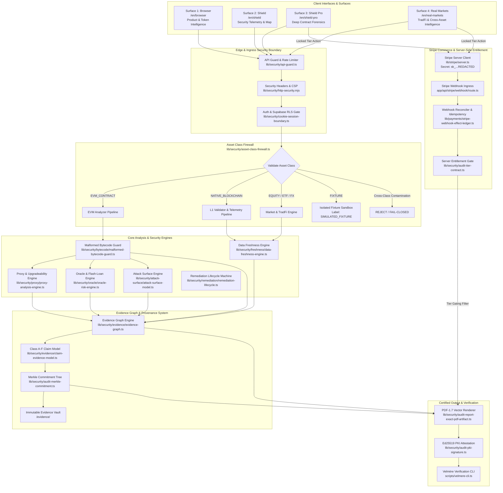

# VELMÈRE COMPREHENSIVE ARCHITECTURE DIAGRAM (FURNACE v2)

*System Version: 2.4.0-worldclass*  
*Standard: OWASP-SC-TOP10 + ERC-STANDARDS + FAIL-CLOSED-EVIDENCE-V3*

---

## 1. High-Level Architecture Diagram

---

## 2. Invariant Enforcement & Fail-Closed Boundaries

### 2.1 Bytecode Integrity Invariant
$$\text{bytecode} \in \{\emptyset, \text{invalid\_hex}, < 8\text{ bytes}\} \implies \begin{cases} \text{claims}_{\text{bytecode}} = 0 \\ \text{riskScore} = \text{null (NOT SCORED)} \\ \text{status} = \text{missing} \end{cases}$$

### 2.2 Asset Class Isolation Boundary
Each analysis pipeline declares an immutable whitelist:
$$\text{Analyzer}(A) \implies A.\text{class} \in \text{Analyzer}.\text{supportedClasses}$$
If $A.\text{class} \notin \text{Analyzer}.\text{supportedClasses}$, the request is rejected with `[FAIL-CLOSED FIREWALL]` and zero downstream execution occurs.

### 2.3 Entitlement & Webhook Invariant
No client state (`localStorage`, query parameter, or cookie) can grant entitlement. Entitlement is granted strictly upon:
1. Server-side verification of `Stripe-Signature` header via HMAC-SHA256.
2. Verified event status `checkout.session.completed` or `customer.subscription.created`.
3. Idempotent insertion into `stripe-webhook-effect-ledger.ts` preventing duplicate fulfillment.
4. Cryptographic attestation binding the user ID to the subscription period.

---

## 3. Data Flow Across the 4 Application Surfaces

### Surface 1: Browser (`/[locale]/browser`)
- **Primary Function:** Public search, real-time token telemetry, overview risk grades.
- **Data Pathways:**
  - Ingests tickers and contract addresses via `/api/search`.
  - Displays verified token metrics, DEX liquidity, and basic risk classification.
  - Generates Basic Tier PDF on request.

### Surface 2: Shield (`/[locale]/shield`)
- **Primary Function:** Systemic on-chain security monitoring, vulnerability map, threat telemetry.
- **Data Pathways:**
  - Queries real-time whale watch and contract anomaly feeds.
  - Renders threat radar across verified protocols.
  - Rejects unverified synthetic data.

### Surface 3: Shield Pro (`/[locale]/shield-pro`)
- **Primary Function:** Institutional smart contract audit, bytecode disassembly, selector collision analysis.
- **Data Pathways:**
  - Disassembles runtime bytecodes via `evm-bytecode-analyzer.ts`.
  - Validates EIP-1167, EIP-1967, and EIP-2535 proxy implementations.
  - Requires active Pro or Advanced server-side entitlement to unlock remediation diffs.

### Surface 4: Real Markets (`/[locale]/real-markets`)
- **Primary Function:** Traditional financial intelligence, equities, ETFs, FX, commodity futures.
- **Data Pathways:**
  - Queries multi-source financial oracles with staleness monitoring.
  - Prohibits blockchain-specific terminology (Solidity, delegatecall) on equities.
  - Executes cross-asset volatility and liquidity depth assessments.
