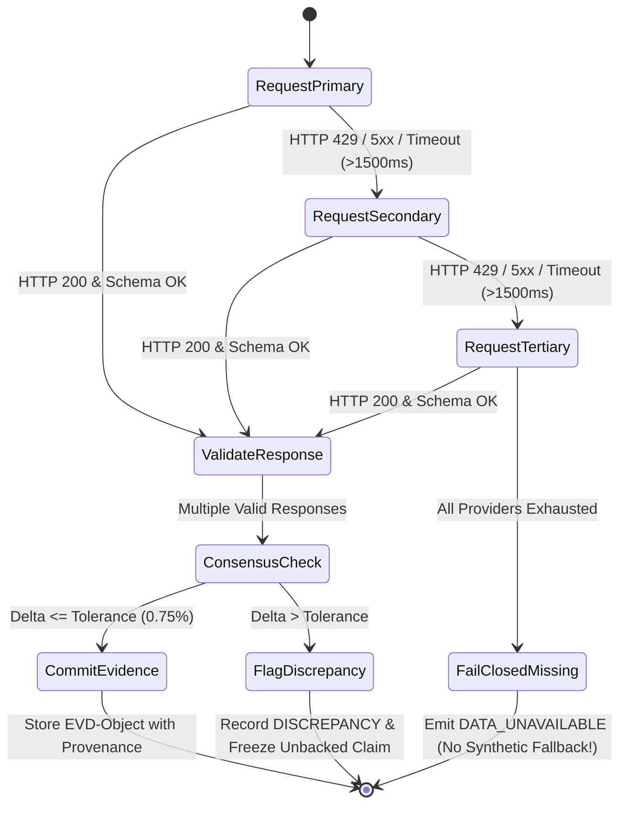

# VELMÈRE GLOBAL PROVIDER MATRIX & FAILOVER SPECIFICATION (FURNACE v2)

*Standard: ISO/IEC 25012 Data Quality & OWASP Fail-Closed Redundancy*  
*Role Taxonomy: Primary (Rank 1), Secondary (Rank 2), Tertiary / Fallback (Rank 3)*

---

## 1. Multi-Chain EVM RPC & Infrastructure Providers

| Network | Primary Provider (Rank 1) | Secondary Provider (Rank 2) | Tertiary Provider (Rank 3) | Free Tier Quota / Rate Limits | Commercial Terms | Failover Policy |
|---|---|---|---|---|---|---|
| **Ethereum Mainnet** | **Cloudflare Ethereum Gateway** `https://cloudflare-eth.com` | **PublicNode / Allnodes** `https://ethereum-rpc.publicnode.com` | **LlamaNodes** `https://eth.llamarpc.com` | Unmetered (Cloudflare: ~100 req/s, Llama: 15 req/s) | Free for public/commercial use | Switch to Secondary on HTTP 429/503 or latency > 1200ms |
| **BNB Smart Chain** | **Binance Official RPC** `https://bsc-dataseed.binance.org/` | **Ankr BSC RPC** `https://rpc.ankr.com/bsc` | **PublicNode BSC** `https://bsc-rpc.publicnode.com` | 10k req/min, burst 50 req/s | Public RPC terms | Failover on timeout (>1500ms) |
| **Polygon PoS** | **Polygon Official RPC** `https://polygon-rpc.com/` | **Ankr Polygon** `https://rpc.ankr.com/polygon` | **1RPC / Automata** `https://1rpc.io/matic` | 100 req/s | Public terms (Fair use) | Failover on 429 or block height lag > 10 blocks |
| **Arbitrum One** | **Arbitrum Official RPC** `https://arb1.arbitrum.io/rpc` | **PublicNode Arbitrum** `https://arbitrum-one-rpc.publicnode.com` | **Ankr Arbitrum** `https://rpc.ankr.com/arbitrum` | 200 req/s | Public open use | Failover on HTTP 500/502 |
| **Base** | **Coinbase Base RPC** `https://mainnet.base.org` | **Ankr Base** `https://rpc.ankr.com/base` | **PublicNode Base** `https://base-rpc.publicnode.com` | 150 req/s | Free commercial fair-use | Failover on connection reset |
| **Optimism Mainnet** | **Optimism Official RPC** `https://mainnet.optimism.io` | **PublicNode OP** `https://optimism-rpc.publicnode.com` | **Ankr OP** `https://rpc.ankr.com/optimism` | 100 req/s | Public terms | Failover on error rate > 5% |
| **Avalanche C-Chain**| **Ava Labs Official** `https://api.avax.network/ext/bc/C/rpc` | **PublicNode Avax** `https://avalanche-c-chain-rpc.publicnode.com` | **Ankr Avalanche** `https://rpc.ankr.com/avalanche` | 100 req/s | Public terms | Failover on latency > 1000ms |

---

## 2. Non-EVM Native L1 Blockchain Providers

| Chain | Primary Provider | Secondary Provider | Tertiary Provider | Free Quota | Terms | Fallback Trigger |
|---|---|---|---|---|---|---|
| **Bitcoin (BTC)** | **Mempool.space API** `https://mempool.space/api` | **Blockstream Info API** `https://blockstream.info/api` | **Blockchain.info Raw** `https://blockchain.info` | Mempool: ~10 req/s fair use | Open Source / Fair Use (Mempool GNU AGPL/Commercial license for hosted) | Switch on HTTP 429 |
| **Solana (SOL)** | **Solana Public Mainnet** `https://api.mainnet-beta.solana.com` | **Ankr Solana** `https://rpc.ankr.com/solana` | **Serum RPC** `https://solana-api.projectserum.com` | 40 req/10s | Public cluster terms | Failover on 429 rate limit |
| **Cardano (ADA)** | **Blockfrost Open Tier** `https://cardano-mainnet.blockfrost.io/api/v0` | **Koios API** `https://api.koios.rest/api/v1` | **Cardano Explorer Raw** | 50k req/day (Blockfrost) | Commercial license available | Failover on quota exhaustion |
| **XRP Ledger** | **XRPL Cluster Official** `https://s1.ripple.com:51234/` | **XRPL Foundation Public** `https://xrplcluster.com` | **Ankr XRPL** | Unmetered (Fair use) | Open source MIT / Public API | Failover on connection drops |

---

## 3. Market Pricing, Historical OHLCV & TradFi Providers

| Category | Primary Provider (Rank 1) | Secondary Provider (Rank 2) | Tertiary Provider (Rank 3) | Free Quota & Limits | Terms / Commercial Scope | Consensus & Discrepancy Policy |
|---|---|---|---|---|---|---|
| **Crypto Spot & Klines** | **Binance Public Market API** `https://api.binance.com/api/v3` | **CoinGecko Demo API** `https://api.coingecko.com/api/v3` | **Coinbase Public Exchange** `https://api.exchange.coinbase.com` | Binance: 1200 req/min; CG: 30 req/min | Binance open public; CG demo non-commercial, upgrade to Pro for enterprise | Tolerance: $\Delta \le 0.75\%$. If $\Delta > 0.75\%$, flag \`DISCREPANCY\` |
| **Equities & ETFs** | **Yahoo Finance Query API** `https://query1.finance.yahoo.com/v8` | **Finnhub Stock API** `https://finnhub.io/api/v1` | **Alpha Vantage Free Tier** `https://www.alphavantage.co/query` | Yahoo: unmetered fair-use; Finnhub: 60 req/min; AV: 25 req/day | Yahoo: Informational; Finnhub: Commercial tier required for resale | Minimum 2-source agreement. Staleness threshold: 15 min during market hours |
| **Commodities & Futures** | **St. Louis Fed (FRED) API** `https://api.stlouisfed.org/fred` | **Yahoo Commodities** (Gold, Oil) | **Investing.com Public Feeds** | FRED: 120 req/min free with key | FRED: Public domain; Free redistribution | Flag if quote age > 24 hours (Mark: \`AGING\` / \`STALE\`) |
| **Foreign Exchange (FX)**| **European Central Bank (ECB)** `https://data-api.ecb.europa.eu` | **ExchangeRate-API Free** `https://open.er-api.com/v6` | **Frankfurter API** `https://api.frankfurter.app` | ECB: Unmetered; Frankfurter: Open API | ECB: Public sector open data (CC BY 4.0) | Daily fixing baseline. Arbitrate against ECB fixing |

---

## 4. Contract Metadata, Source Verification & Security Databases

| Intelligence Domain | Primary Provider | Secondary Provider | Tertiary Provider | Free Quota | Terms | Fallback Trigger |
|---|---|---|---|---|---|---|
| **Etherscan Verification** | **Etherscan API** `https://api.etherscan.io/api` | **Sourcify Open Metadata** `https://sourcify.dev/server` | **Blockscout Public API** `https://eth.blockscout.com/api` | Etherscan: 5 req/s (Free); Sourcify: Unmetered | Etherscan: API Key terms; Sourcify: MIT/Open Data | If unverified on Etherscan, query Sourcify exact IPFS match |
| **Smart Contract Vulnerabilities**| **OWASP SC Top 10 Database** | **SWC Registry Archive** `https://swcregistry.io` | **National Vulnerability Database (NVD)** | Local offline synchronized repository | Open Source / Public Domain | Offline local lookup — zero network dependency |
| **DEX Liquidity & Reserves** | **The Graph Uniswap V3 Subgraph** | **GeckoTerminal Public API** `https://api.geckoterminal.com/api/v2` | **DeFiLlama TVL API** `https://api.llama.fi` | GeckoTerminal: 30 req/min; DeFiLlama: Unmetered | DeFiLlama: Open attribution; Gecko: Free tier | Verify spot AMM reserves across at least 2 pools |

---

## 5. Failover State Machine & Consensus Logic

### 5.1 Deterministic Missing Data Classification
When data is absent, the engine records one of the following canonical error codes:
1. `ERR_PROVIDER_UNAVAILABLE`: Network failure or HTTP 503 across all 3 tiers.
2. `ERR_RATE_LIMIT_EXHAUSTED`: HTTP 429 on all available endpoints.
3. `ERR_ASSET_NOT_SUPPORTED`: Asset does not exist in provider catalog (e.g. unlisted token).
4. `ERR_DATA_UNAVAILABLE_MARKET_CLOSED`: Equity/FX market outside operational trading hours.
5. `ERR_STALE_QUOTE_EXCEEDED`: Quote age exceeds 72 hours without active heartbeat.
6. `ERR_FAIL_CLOSED_FIREWALL`: Asset class incompatible with requested analysis module.
