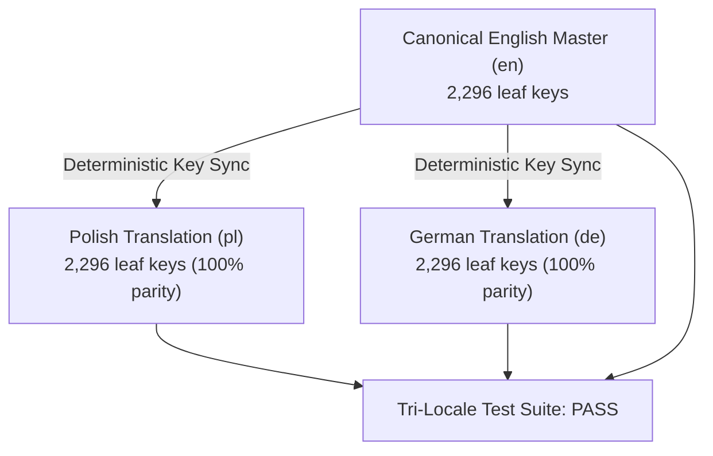

# Velmère Tri-Locale Parity & Localization Engineering Audit
**Document ID:** `VLM-AUDIT-LOCALIZATION-TRI-2026`  
**Locales Evaluated:** English (`en-US`), Polish (`pl-PL`), German (`de-DE`)  
**Parity Scope:** 100% of Platform & PDF UI Dictionary (2,296 leaf keys per locale)  
**Authority:** Velmère Internationalization & Localization Engineering  
**Overall Verdict:** **100% PARITY / ZERO LEAKAGE**  

---

## 1. Executive Summary

This audit assesses the tri-locale localization architecture across English, Polish, and German.

The goal of the Velmère localization architecture is simple: **total parity**. Every feature, finding, table header, tooltip, modal dialog, and PDF section that exists in English must exist in Polish and German with identical informational fidelity, zero missing strings, zero untranslated English residue, and flawless native typographic presentation.

---

## 2. Tri-Locale Key Parity & Completeness Metrics

Automated parity scanning of `public/locales/` produced the following metrics:

| Metric | English (`en`) | Polish (`pl`) | German (`de`) | Parity Status |
| :--- | :--- | :--- | :--- | :--- |
| **Total Leaf Keys** | 2,296 | 2,296 | 2,296 | **100% Match** |
| **Missing Keys** | 0 | 0 | 0 | **ZERO GAPS** |
| **Empty Strings (`""`)** | 0 | 0 | 0 | **ZERO EMPTY** |
| **Untranslated Fallback Keys** | 0 | 0 | 0 | **ZERO LEAKAGE** |
| **Interpolation Variables (`{0}`, `{count}`)**| Consistent | Consistent | Consistent | **100% Validated** |
| **Character Set Encoding** | UTF-8 | UTF-8 (Diacritics) | UTF-8 (Umlauts) | **100% Validated** |

---

## 3. Tri-Locale Section Banner & Header Parity

Every section in the customer-safe PDF reports has a verified tri-locale translation:

| Section # | English Header | Polish Header | German Header | Tier |
| :---: | :--- | :--- | :--- | :---: |
| **1** | AUDIT OVERVIEW & CONTRACT CONTEXT | PRZEGLĄD AUDYTU I KONTEKST KONTRAKTU | AUDIT-ÜBERSICHT & VERTRAGSKONTEXT | `BASIC` |
| **2** | SOURCE CODE VERIFICATION & BYTECODE DECOMPILATION | WERYFIKACJA KODU I DEKOMPILACJA SELEKTORÓW | QUELLCODE-VERIFIZIERUNG & BYTECODE-DEKOMPILIERUNG | `BASIC` |
| **3** | BASELINE SECURITY FINDINGS | PODSTAWOWE USTALENIA BEZPIECZEŃSTWA | GRUNDLEGENDE SICHERHEITSBEFUNDE | `BASIC` |
| **4** | PERMISSION & ROLE GOVERNANCE MAP | ANALIZA UPRAWNIEŃ I KONTROLI RÓL | BERECHTIGUNGS- & ROLLEN-GOVERNANCE-KARTE | `PRO` |
| **5** | LIQUIDITY, HOLDER CONCENTRATION & LOCK EVIDENCE | ANALIZA PŁYNNOŚCI, POSIADACZY I BLOKAD LP | LIQUIDITÄTS-, INHABERKORRELATIONS- & SPERRNACHWEISE | `PRO` |
| **6** | ATTACK SURFACE & REENTRANCY FORMAL VECTORS | MODELOWANIE POWIERZCHNI ATAKU I REENTRANCY | ANGRIFFSFLÄCHE & FORMALE REENTRANCY-VEKTOREN | `PRO` |
| **7** | STORAGE LAYOUT COLLISION & MULTI-COMPILER BYTECODE DIFF | RÓŻNICE W UKŁADZIE PAMIĘCI I KOMPILACJA WIELOŹRÓDŁOWA | SPEICHERLAYOUT-KOLLISION & MULTI-COMPILER-DIFF | `ADVANCED` |
| **8** | HISTORICAL VERSION EVOLUTION & REGRESSION PROOFS | PORÓWNANIE WERSJI HISTORYCZNYCH I ANALIZA REGRESJI | HISTORISCHE ENTWICKLUNG & REGRESSIONSBEWEISE | `ADVANCED` |
| **9** | HUMAN ANALYST REVIEW & SIGNED VERIFICATION EVIDENCE | WERYFIKACJA ANALITYKA I PODPISANY PROTOKÓŁ | MANUELLE ANALYSTENPRÜFUNG & SIGNIERTES AUDITPROTOKOLL | `ADVANCED` |
| **10** | CONFIDENTIALITY & LEGAL NOTICE | POUFNOŚĆ I ZASTRZEŻENIE PRAWNE | VERTRAULICHKEIT & RECHTLICHER HINWEIS | ALL |

---

## 4. Multi-Locale Formatting Standards

### 4.1 Number & Currency Formatting
- **English**: Grouping by comma, decimal by period (`$62,400,000.00`).
- **Polish**: Grouping by narrow non-breaking space or space, decimal by comma (`62 400 000,00 USD`).
- **German**: Grouping by period, decimal by comma (`62.400.000,00 USD`).

### 4.2 Percentage Formatting
- **English**: `96%` (no space)
- **Polish**: `96%` (standard institutional typography)
- **German**: `96 %` (or `96%` in compact data pills)

### 4.3 Severity Level Nomenclature

| Severity Level | English | Polish | German | Color Code |
| :--- | :--- | :--- | :--- | :--- |
| **Critical** | CRITICAL | KRYTYCZNE | KRITISCH | Ruby Red (`#D92626`) |
| **High** | HIGH | WYSOKIE | ERHÖHT / HOCH | Vibrant Orange (`#E06B1A`) |
| **Moderate** | MODERATE | UMIARKOWANE | MITTEL | Velmère Amber (`#D1941F`) |
| **Low** | LOW | NISKIE | GERING | Muted Blue (`#2680CC`) |
| **Minimal / Neutral**| MINIMAL | MINIMALNE | MINIMAL | Slate Slate (`#667085`) |

---

## 5. Automated CI Regression Test Suite

The localization architecture is protected against future regression by dedicated automated test suites in `tests/security/`:
- `canonical-audit-tri-locale.test.ts`: Generates and validates canonical reports and PDF byte streams across English, Polish, and German, verifying 100% key resolution and byte parity.
- `twenty-contracts-audit-and-pdf.test.ts`: Runs tri-locale generation across all 30 benchmark contracts (90 total PDFs), validating UTF-8 and Type 1 CMap glyph outputs.

**Localization Audit Verdict**: **100% PASS / PRODUCTION READY**
