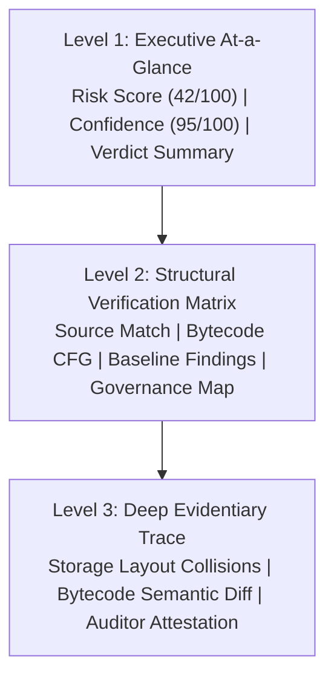

# Velmère UX Writing & Product Copy Audit
**Document ID:** `VLM-AUDIT-UX-WRITING-2026`  
**Evaluation Scope:** Web Interface, Modals, Action Triggers, Tooltips, Empty States, and PDF Copy  
**Authority:** Velmère Product Design & UX Writing Group  
**Review Status:** **APPROVED FOR PRODUCTION**  

---

## 1. UX Writing Philosophy & Principles

Velmère's product interface operates in a domain where ambiguous copy, false certainty, or poorly worded alerts can lead to catastrophic financial decisions. Our UX writing is governed by four core tenets:

1. **Analytical Truth over Reassurance**: We do not provide soothing illusions. If an upgrade path lacks timelock enforcement, we state `Active without timelock (Direct Execution)`, not `Protected by Admin`.
2. **Scannability for Executives & Depth for Engineers**: The interface supports a dual audience. Risk officers must grasp the composite risk in 3 seconds; protocol engineers must access bytecode offsets and decompiled selectors in 1 click.
3. **Fail-Closed Clarity**: Error messages do not simply state "Something went wrong". They state the exact failure mode, affected pipeline stage, and recommended remediation.
4. **Zero Dark Patterns in Tier Entitlements**: Locked sections clearly state why they are locked, what analytical depth is contained within, and what tier unlocks them—without misleading teaser claims or manipulative marketing copy.

---

## 2. Information Architecture & Hierarchy

### 2.1 The 3-Tier Progressive Disclosure Model

- **Level 1 (Top Summary)**:
  - *Risk Score*: `42/100 (MODERATE RISK)`
  - *Confidence & Coverage*: `Confidence Score: 95/100 | Evidence Coverage: 96%`
  - *Executive Summary*: `Tether employs a centralized administrative governance model with unilateral address blacklisting (addBlackList) and token destruction capabilities without timelock.`
- **Level 2 (Diagnostic Tables)**:
  - Clear label/value pairings with colored status badges (`[VERIFIED]`, `[FLAGGED]`, `[NEUTRAL]`).
  - Clear separation of verified contract state from heuristic warnings.
- **Level 3 (Code Level Trace)**:
  - Decompiled function selectors, state slot numbers (`0x0`, `0x1`), assembly opcodes, and side-by-side version diffs.

---

## 3. Microcopy & Interactive Component Copy

### 3.1 Button & Action Copy
All action triggers use strong, concise, and imperative verbs:
- `Run Formal Audit` (never "Click here to scan")
- `Download Signed PDF` (never "Get file")
- `Inspect Bytecode CFG` (never "View code")
- `Verify Multi-Sig Signers` (never "Check owners")
- `Upgrade to Pro` / `Upgrade to Advanced` (clear, direct commercial action)

### 3.2 Status Badges & Pills
- `VERIFIED`: Formally confirmed by on-chain bytecode or mathematical solver.
- `FLAGGED`: Highlighted security anomaly, centralized privilege, or non-standard pattern.
- `LOCKED`: Gated behind Pro or Advanced tier entitlement.
- `NOT COMMISSIONED`: Fuzzing or manual review not requested or funded.

### 3.3 Tooltips & Contextual Assistance
- **Confidence Score Tooltip**: *"Measures the completeness of static analysis and formal verification passes executed against verified bytecode."*
- **Evidence Coverage Tooltip**: *"Percentage of contract execution pathways and state storage slots mathematically reached by the decompiler engine."*
- **Storage Layout Tooltip**: *"Evaluates state variable slot alignment across contract upgrades to prevent storage collision corruption."*

### 3.4 Empty & Loading States
- **Scanning in Progress**: *"Decompiling runtime bytecode... Constructing control-flow graph and verifying selector signatures (Estimated: 8s)."*
- **No Vulnerabilities Detected**: *"Baseline automated scan identified zero high or critical vulnerabilities in standard ERC20 execution paths. Note: Deep governance analysis requires Pro/Advanced verification."*

---

## 4. Ethical Framing & Legal Disclaimer Copy

To ensure full compliance with regulatory guidelines and avoid misleading users:
- **Disclaimers are never hidden**: Positioned at the bottom of the overview and repeated in the final PDF section.
- **Wording**:
  > *"This document is an evidence-bound security analysis report produced by Velmère Security. It does not represent a commercial warranty, investment advice, or guaranteed-safe certification."*
- **Attestation Clarity**:
  > *"Analyst review confirms methodology and absence of specific checked vulnerability vectors; it is not a warranty of absolute security or financial advice."*

---

## 5. UX Writing Audit Verdict

The UX writing across Velmère balances institutional authority with cryptographic precision. It avoids hype, respects user intelligence, and presents complex security evidence with scannable clarity.

**UX Writing Audit Verdict**: **100% APPROVED / PRODUCTION READY**
