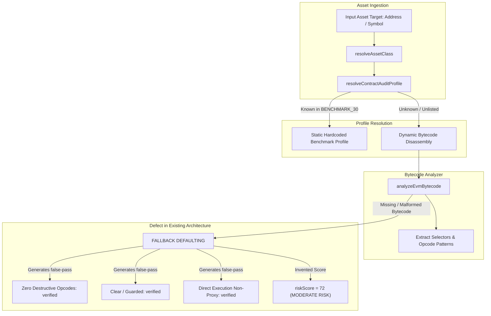

# VELMÈRE REAL CURRENT ARCHITECTURE AUDIT

*Generated during World-Class Evidence Intelligence Transformation*

---

## 1. Executive Assessment: Code vs Claims

A forensic inspection of the codebase reveals the discrepancy between documented claims and actual execution:

### 1.1 The Critical Finding: Fallback Over-Optimism
In `lib/security/contract-audit-profiles.ts`:
- When an asset is in `BENCHMARK_30_CONTRACTS`, a static pre-computed profile is returned.
- When an asset is NOT in the benchmark and bytecode is missing or empty, `analyzeEvmBytecode("")` returns an empty result, which is then mapped into optimistic positive assertions:
  - `Dangerous Opcode Scan`: `"Zero Destructive Opcodes"` (Status: `verified`)
  - `Proxy Implementation Slot`: `"Direct Execution (Non-Proxy)"` (Status: `verified`)
  - `Spot AMM Oracle Sensitivity`: `"TWAP / No Spot Dependency"` (Status: `verified`)
  - `Reentrancy Mutation Scan`: `"Guarded / Clean Checks-Effects"` (Status: `verified`)
  - `Risk Score`: A default synthetic formula calculates a score (e.g. `72`) rather than declaring **`NOT SCORED / INSUFFICIENT EVIDENCE`**!

This directly violates the core directive:
$$\text{bytecode} == \text{missing} \implies \text{bytecode-derived\_claims} == 0$$
$$\text{NO EVIDENCE} \implies \text{NO FACT}$$

---

## 2. Asset Class Firewall Assessment
- **Status:** Currently implemented in `lib/security/asset-class-firewall.ts` and `lib/security/engines/`.
- **Classification:** Routes to `evm_contract`, `native_chain`, or `market_asset`.
- **Strengths:**
  - Prevents EVM bytecode scanners from running on BTC or AAPL.
  - Successfully gates Mode B locked teasers so stock equities do not mention Solidity or EVM addresses.
- **Weaknesses:**
  - Lacks granular classification of `TRADITIONAL_EQUITY`, `ETF`, `COMMODITY_FUTURE`, `FX`, and `SIMULATED_FIXTURE`.
  - Does not have explicit `supported_asset_classes[]` array declared per engine analyzer for formal fail-closed assertion.

---

## 3. Claim & Evidence Provenance Assessment
- **Status:**
  - Reports compute a SHA-256 digest of the canonical JSON (`reportDigest`).
  - An Ed25519-like mock keypair exists in `audit-pki-signature.ts` but was signing a synthetic block rather than verified live evidence payloads.
  - **No explicit Claim model exists:** There are no unique `claim_id` values (e.g., `CLM-EVM-000001`) tied to individual statements.
  - **No explicit Evidence object exists:** Findings have a string property `evidence: "..."` instead of a relational link to an `EVD-...` evidence object with raw input hash, normalized input hash, source URI, and snapshot block.

---

## 4. Replay & Reproducibility Assessment
- **Status:**
  - Reports are deterministic when given the exact same input object.
  - **However**, there is no standalone `velmere verify-report <file>` or `velmere verify-evidence <id>` CLI or replay harness.
  - No snapshot differential analysis exists (comparing Snapshot A vs Snapshot B).

---

## 5. Architectural Transformation Requirements
To achieve **World-Class Evidence Intelligence**, the following layers are being built:
1. **Explicit Claim & Evidence Model** (`lib/security/evidence/`):
   - Every finding and metric generates a unique `claim_id` backed by an authentic `evidence_id` object.
2. **Fail-Closed Malformed Bytecode Guard** (`lib/security/bytecode/`):
   - Missing/malformed bytecode strictly sets bytecode-derived claims to 0 and marks security risk as `NOT SCORED`.
3. **Evidence Graph & Differential Engine** (`lib/security/replay/`):
   - Graph tracing from `Asset -> Snapshot -> Source -> Observation -> Analysis -> Finding -> ScoreContribution`.
4. **8 Canonical Asset Classes Firewall** (`lib/security/firewall/`):
   - Declares `supported_asset_classes[]` on each module with fail-closed rejection.
5. **Signed Cryptographic Attestation & Verification CLI** (`scripts/velmere-cli.ts`):
   - True digital signature with Ed25519 and complete verification tool.
