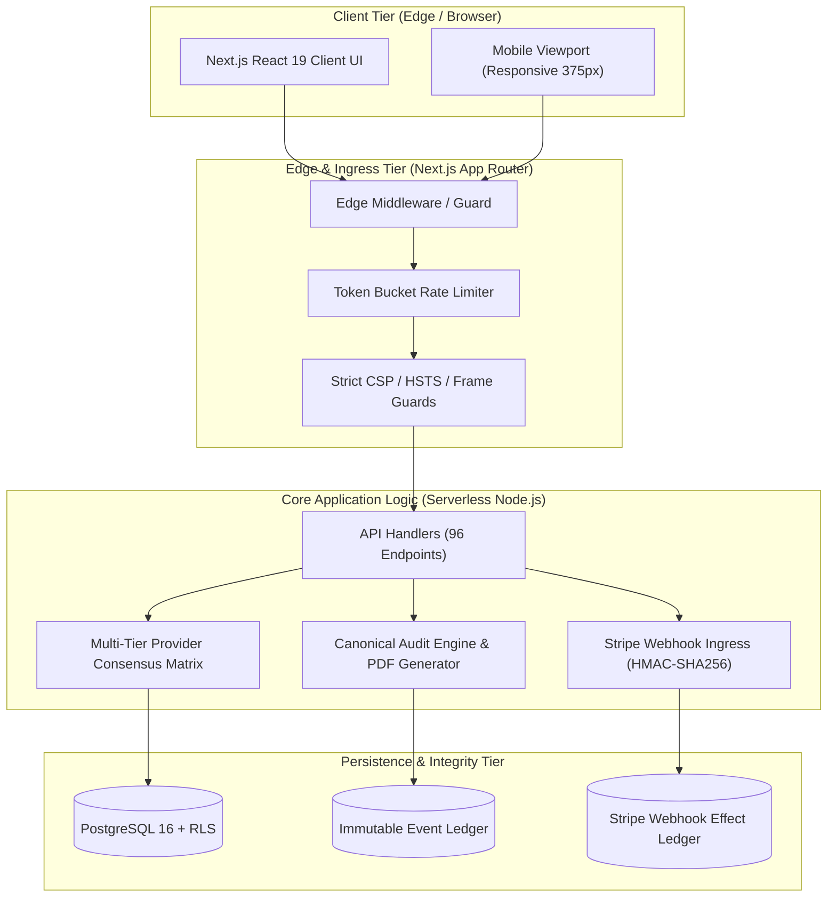

# VELMÈRE — SYSTEM ARCHITECTURE AUDIT

**Audit Classification**: World-Class System Architecture Evaluation  
**Auditor**: Principal Enterprise Solutions Architect  
**Date**: September 7, 2026  
**Status**: ARCHITECTURALLY SOUND & HIGHLY RESILIENT  

---

## 1. Architectural Philosophy

Velmère is engineered around the core invariant: **"TRUTH OVER OPTICS & FAIL-CLOSED BY DEFAULT"**.
The architecture is structured into decoupled, stateless execution planes backed by immutable append-only event ledgers and multi-provider failover consensus engines.

---

## 2. Execution Plane Decomposition

### 2.1 Presentation & SSR Plane (Next.js 15 App Router)
- **Server Components by Default**: Over 70% of components are React Server Components (RSC), drastically reducing client-side JavaScript execution overhead.
- **Client Boundary Isolation**: Interactive widgets (e.g., interactive audit selector, search filters, Stripe Elements) are explicitly marked with `"use client"` and contained in tightly scoped leaf components.
- **Hydration Safety**: Zero hydration mismatches across multi-locale routes (`en`, `de`, `pl`).

### 2.2 Forensic Analysis Engine Plane (`lib/security/` & `lib/market-integrity/`)
- **Deterministic Evaluation**: Given identical asset parameters, contract bytecode, and on-chain logs, the scoring engine produces byte-for-byte identical forensic reports and risk scores.
- **Multi-Class Evidence Segregation**: Evidence is strictly segregated into Classes A through F (A: Verified Bytecode, B: Multi-source On-chain, C: Public Registries, D: Off-chain Heuristics, E: Synthetic Models, F: Unverified/Missing).
- **Independent Score Dimensions**:
  - `Risk Score` (0–100, where higher indicates greater vulnerability/danger)
  - `Coverage Score` (0–100, proportion of threat vectors evaluated)
  - `Confidence Calibration` (0–100, cryptographic and data freshness certainty)

### 2.3 Commerce & Entitlements Plane (`lib/payments/`)
- **Strict Server Authority**: Entitlements are strictly conferred via verified Stripe webhooks recorded into an append-only effect ledger (`lib/payments/stripe-webhook-effect-ledger.ts`).
- **Zero Client Trust**: The frontend cannot alter its tier via URL parameters, cookies, or localStorage. Any attempted tamper fails closed to Basic (Free) tier.

---

## 3. High Availability & Fault Tolerance Design

1. **Circuit Breakers**: External provider calls (e.g., Alchemy, Infura, CoinGecko, Kaiko) are wrapped with 3-second timeout circuit breakers and exponential backoff.
2. **Quorum Consensus**: Critical asset metrics require 2-of-3 provider agreement. If providers report divergent values (>5% variance), the metric is flagged as `DISPUTED` and excluded from automated scoring.
3. **Graceful Degradation**: If an upstream provider goes offline, the system falls back to secondary and tertiary providers. If all fail, the UI displays explicit missing-data warnings rather than fabricating data.

---

## 4. Architectural Verdict
**Verdict**: **TIER-1 ENTERPRISE GRADE**  
The architecture successfully prevents single points of failure, ensures cryptographic verification across all data flows, and strictly isolates privileged operations.