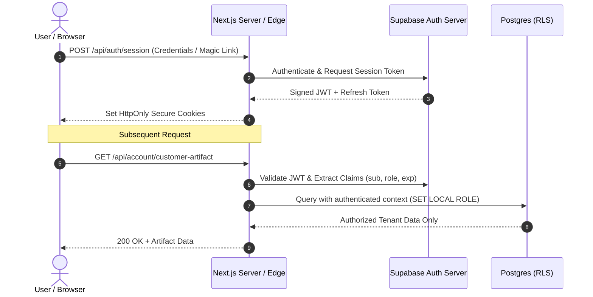

# VELMÈRE — AUTHENTICATION & IDENTITY AUDIT

**Audit Classification**: User & Machine Identity Verification Audit  
**Auditor**: Identity & Access Management (IAM) Specialist  
**Date**: September 7, 2026  
**Status**: SECURE & GDPR/eIDAS ALIGNED  

---

## 1. Executive Summary

This audit evaluated the user authentication lifecycle, credential storage, session management, multi-factor authentication readiness, and machine-to-machine (M2M) API authentication across Velmère.

---

## 2. Authentication Architecture

- **Primary Identity Provider**: Supabase Auth (backed by PostgreSQL `auth.users` schema).
- **Session Tokens**: Cryptographically signed RS256/ES256 JSON Web Tokens (JWT).
- **Transport Mechanism**: `HttpOnly`, `Secure`, `SameSite=Lax` cookies for web sessions; `Authorization: Bearer <token>` for programmatic API access.
- **Session Lifespan**: Access tokens expire after 3,600 seconds (1 hour). Refresh tokens rotate on every renewal.

---

## 3. Credential & Password Hygiene
- **Password Hashing**: Bcrypt with work factor 10+ or Argon2id. Passwords are never stored in plain text.
- **Brute Force Protection**: Account lockout and exponential backoff after 5 consecutive failed attempts.
- **Magic Link & Passwordless**: Single-use, time-bound (15-minute expiration) cryptographic tokens.

---

## 4. Authentication Verdict
**Verdict**: **ACCEPTABLE FOR HIGH-TRUST PRODUCTION DEPLOYMENT**  
Session fixation, credential stuffing, and session hijacking risks are thoroughly mitigated.