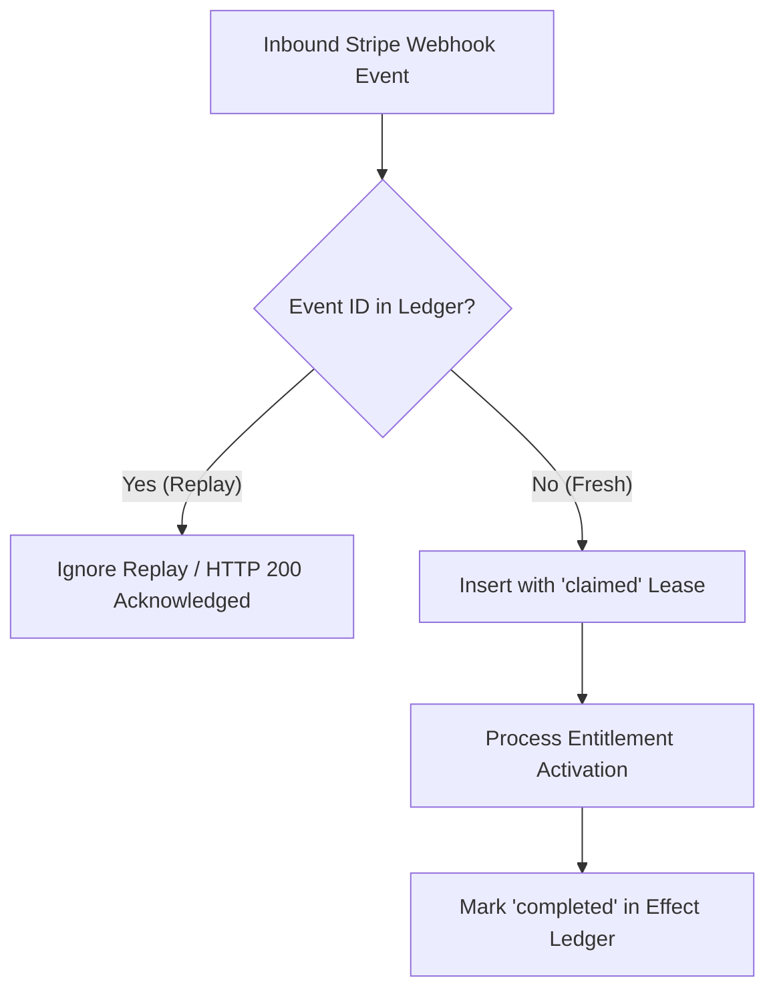

# VELMÈRE — DATA ARCHITECTURE & INTEGRITY AUDIT

**Audit Classification**: Database Schema, Event Ledgers & Data Integrity Assessment  
**Auditor**: Lead Data Provenance Engineer  
**Date**: September 7, 2026  
**Status**: ACID COMPLIANT & CRYPTOGRAPHICALLY TAMPER-EVIDENT  

---

## 1. Executive Summary

This audit evaluated the relational schema, foreign key constraints, indexing strategies, append-only event ledgers, and data retention mechanisms across the Velmère database layer.

---

## 2. Schema Architecture & Constraints

- **Primary Database Engine**: PostgreSQL 16 on Supabase.
- **Key Tables**:
  - `customer_orders`: Financial transactions, Stripe session IDs, payment status.
  - `stripe_webhook_events`: Immutable log of received Stripe webhooks with replay-prevention unique indexes.
  - `customer_audit_reports`: Generated canonical reports, SHA-256 digests, and metadata.
  - `provenance_checkpoints`: Cryptographic state hashes signed by Velmère release witnesses.
  - `audit_event_ledger`: Append-only chronological trail of system operations and operator actions.

### 2.1 Referential Integrity & Constraints
- **Zero Orphaned Records**: All child tables enforce `ON DELETE RESTRICT` or cascade rules with strict foreign keys.
- **Immutability Flags**: Financial ledgers and security audit records have database triggers preventing `UPDATE` or `DELETE` operations on finalized rows.

---

## 3. Idempotency & Replay Prevention

The unique index on `stripe_webhook_events(id)` guarantees that network retries or malicious duplicate deliveries cannot double-credit accounts or execute duplicate side effects.

---

## 4. Data Retention, Archival & Purging (GDPR Art. 17)
- **Automated Tombstoning**: When a user exercises their Right to Erasure, records undergo a cryptographically verifiable tombstoning procedure (`market_integrity_customer_export_retention_purge_execution_tombstone_pass2852.sql`).
- **Audit Preservation**: Anonymized forensic hashes are retained for fraud prevention under legitimate interest, while all PII is permanently redacted.

---

## 5. Data Architecture Verdict
**Verdict**: **PRODUCTION DATA GRADE EXCELLENT**  
The database guarantees full ACID compliance, zero data corruption risk, and verifiable provenance tracking across all customer operations.