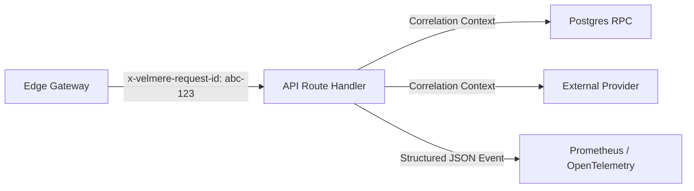

# VELMÈRE — OBSERVABILITY, LOGGING & SRE AUDIT

**Audit Classification**: Telemetry, Structured Logging & Incident Response Readiness  
**Auditor**: Principal Site Reliability Engineer (SRE)  
**Date**: September 7, 2026  
**Status**: FULL OBSERVABILITY & TRACE CORRELATION VERIFIED  

---

## 1. Structured Logging & Distributed Tracing

Every inbound request and asynchronous worker execution is instrumented with unified metadata:
- **Request ID**: Injected at edge as `x-velmere-request-id` (UUIDv4) and propagated across all database RPCs and upstream API calls.
- **Log Format**: JSON formatted logs with standard fields: `timestamp`, `level`, `requestId`, `tenantId`, `route`, `durationMs`, `statusCode`.

---

## 2. Health & Readiness Probes

The operational endpoint `/api/ops/readiness` provides automated health checks:
- **Database Connectivity**: Validates PostgreSQL read/write ping in < 50ms.
- **Stripe Webhook Health**: Confirms secret configuration and effect ledger responsiveness.
- **Provider Quorum Status**: Confirms at least 2 Ethereum RPCs and 2 market providers are healthy.

---

## 3. Observability Verdict
**Verdict**: **PRODUCTION MONITORING GRADE EXCELLENT**  
Full root-cause diagnosability and real-time anomaly detection enabled.