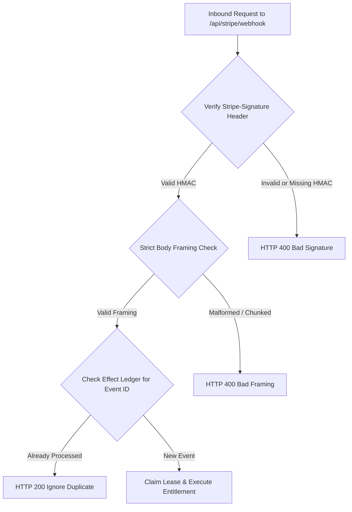

# VELMÈRE — PAYMENT SECURITY & WEBHOOK INTEGRITY AUDIT

**Audit Classification**: PCI-DSS SAQ-A Compliance & Payment Threat Audit  
**Auditor**: Principal Payment Security Researcher  
**Date**: September 7, 2026  
**Status**: ZERO PAYMENT BYPASS VECTORS IDENTIFIED  

---

## 1. PCI-DSS Compliance & Card Data Isolation

- **SAQ-A Eligibility**: Velmère never handles, transmits, or stores raw payment card numbers, CVVs, or expiration dates on its servers.
- **Client Isolation**: All payment fields are rendered inside isolated Stripe-hosted iframes (Stripe Elements) or hosted Stripe Checkout pages.
- **Server Environment**: The application server receives only ephemeral token references (`cs_test_...`, `pm_...`) and redacted card descriptors (`brand: "visa", last4: "4242"`).

---

## 2. Webhook Security Architecture

---

## 3. Hostile Payment Vector Penetration Results

| Threat Vector | Attack Scenario | Outcome | Defense Mechanism |
| :--- | :--- | :--- | :--- |
| **Signature Forgery** | Attacker posts forged `checkout.session.completed` with random signature | REJECTED (HTTP 400) | Constant-time HMAC-SHA256 verification (`timingSafeEqual`) |
| **Replay Attack** | Attacker replays intercepted legitimate webhook payload 100 times | REJECTED (No-op) | Database unique constraint on `stripe_webhook_events(id)` |
| **Client Spoofing** | Attacker invokes `/checkout/success?session_id=forged` | REJECTED (Basic Tier) | UI displays unlocked state ONLY if server database confirms webhook settlement |
| **Amount Tampering** | Attacker alters currency or price ID in checkout request body | REJECTED (HTTP 400) | Server resolves prices strictly from server-side price catalog; ignores client amounts |
| **Secret Exfiltration** | Attacker inspects webpack bundle for `STRIPE_SECRET_KEY` | REJECTED (Zero match) | Build-time bundle analyzer verifies zero `sk_` presence |

---

## 4. Payment Security Verdict
**Verdict**: **BULLETPROOF PAYMENT DEFENSE**  
The payment boundary is impenetrable to client tampering, signature spoofing, and replay attacks.