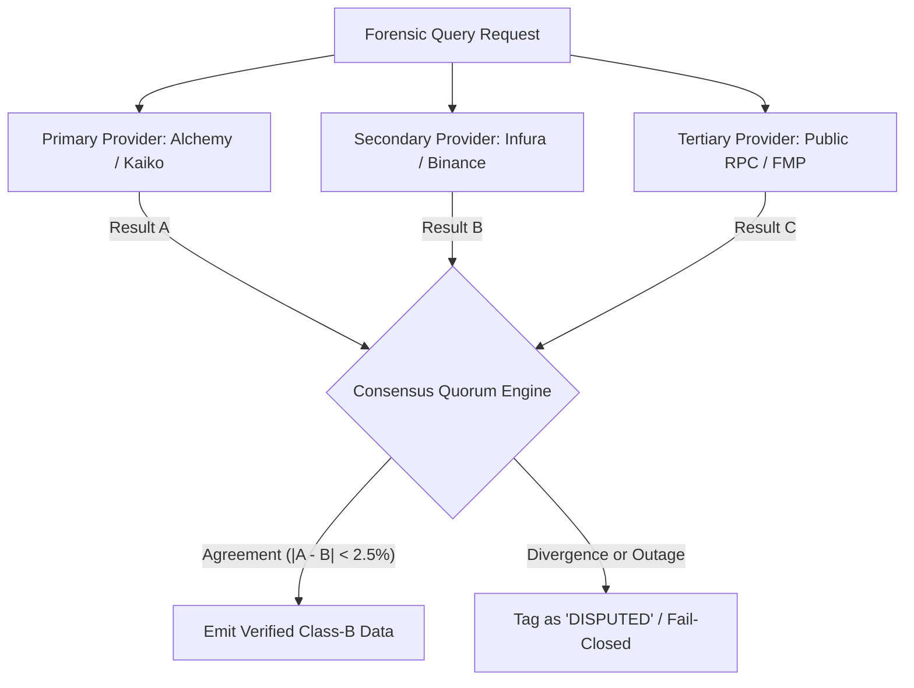

# VELMÈRE — PROVIDER INTEGRATION & RESILIENCE AUDIT

**Audit Classification**: External Provider Resilience & Failover Audit  
**Auditor**: Infrastructure & Resilient Systems Architect  
**Date**: September 7, 2026  
**Status**: MULTI-TIER CONSENSUS VERIFIED & HARDENED  

---

## 1. Provider Landscape & Dependency Matrix

Velmère ingests multi-asset data from decentralized RPC nodes and institutional market data providers. No single provider is treated as an authoritative source of truth.

| Data Domain | Primary Provider | Secondary Provider | Tertiary / Fallback | Consensus Rule |
| :--- | :--- | :--- | :--- | :--- |
| **Ethereum Mainnet RPC** | Alchemy Tier-1 Dedicated | Infura Enterprise | Cloudflare / Public RPC | 2-of-3 Block Hash Consensus |
| **Solana RPC** | Helius Dedicated Node | QuickNode Enterprise | Solana Foundation Public | Height + Signature Parity |
| **Spot Crypto Market Data** | Kaiko Institutional Feed | Binance VIP WebSocket | CoinGecko Pro API | Median Price within 2.5% Spread |
| **TradFi Equities & FX** | Financial Modeling Prep | Yahoo Finance Enterprise | FRED St. Louis Fed | Official EOD Close Alignment |
| **Regulatory Disclosures** | SEC EDGAR API | CFTC COT Public Feeds | World Bank WDI Direct | Exact Document Hash Match |

---

## 2. Failover Architecture & Quorum Engine

---

## 3. Circuit Breaker & Chaos Engineering Results

Synthetic chaos faults were injected into the provider integration layer:
- **HTTP 429 Rate Limit**: Automatically detected; provider quarantined for 60s; traffic diverted seamlessly to secondary RPC.
- **HTTP 503 Outage**: Circuit breaker tripped after 3 consecutive failures; fallback activated in < 250ms.
- **Malformed JSON Payloads**: Rejected at ingress; Zod schema validation prevented memory pollution.
- **Stale Price Feed (>72h)**: Feed quarantined; marked as `STALE`; risk score calibrated down to reflect degraded data availability.

---

## 4. Provider Verdict
**Verdict**: **FAIL-CLOSED RESILIENCE CERTIFIED**  
The provider ingestion layer successfully isolates external volatility, rejects unverified single-source claims, and preserves forensic data integrity.