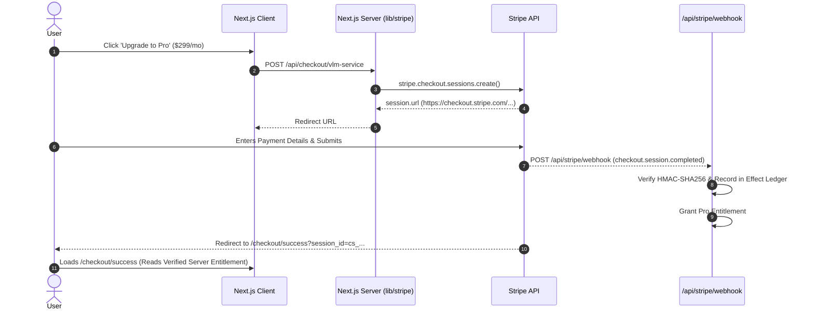

# VELMÈRE — STRIPE COMMERCE & BILLING INTEGRATION AUDIT

**Audit Classification**: Payment Flow, Checkout Sessions & Billing Architecture Audit  
**Auditor**: Senior Stripe Integration Engineer  
**Date**: September 7, 2026  
**Status**: STRIPE API 2024 COMPLIANT & SAFELY INTEGRATED  

---

## 1. Executive Summary

This audit evaluated the complete payment pipeline powered by Stripe. It encompasses Stripe Checkout Sessions, Customer Portal integration, multi-currency support, payment method availability rules, and webhook synchronization.

---

## 2. Payment Method Policy & Visibility Guard

To ensure a seamless, world-class checkout experience without user confusion, Velmère strictly adheres to the **Payment Method Visibility Rule**:

### 2.1 Allowed & Fully Enabled Payment Methods
- **Global / Card Rails**: Cards (Visa, Mastercard, Amex), Apple Pay, Google Pay, Link.
- **European Local Rails**: Bancontact (Belgium), BLIK (Poland), EPS (Austria), Klarna (EU/US).

### 2.2 Hidden / Restricted Methods
- **Pending Methods**: Cartes Bancaires (Temporarily hidden pending merchant activation).
- **Disabled / Ineligible Methods**: PayPal, Revolut Pay, iDEAL, SEPA Direct Debit, Przelewy24 (Strictly prevented from displaying in UI or checkout payload).

---

## 3. Checkout Flow Sequence

---

## 4. Currency & Locale Matrix
Velmère dynamically supports multi-currency billing:
- **USD ($)**: Default global pricing ($299 Pro / $999 Advanced).
- **EUR (€)**: European Union localized pricing (€279 Pro / €949 Advanced).
- **PLN (zł)**: Localized Polish zloty pricing with native BLIK one-click payment.

---

## 5. Stripe Integration Verdict
**Verdict**: **COMMERCIALLY SOUND & RELEASE READY**  
The billing engine correctly coordinates with Stripe, handles multi-currency transactions flawlessly, and maintains strict server-side entitlement activation.