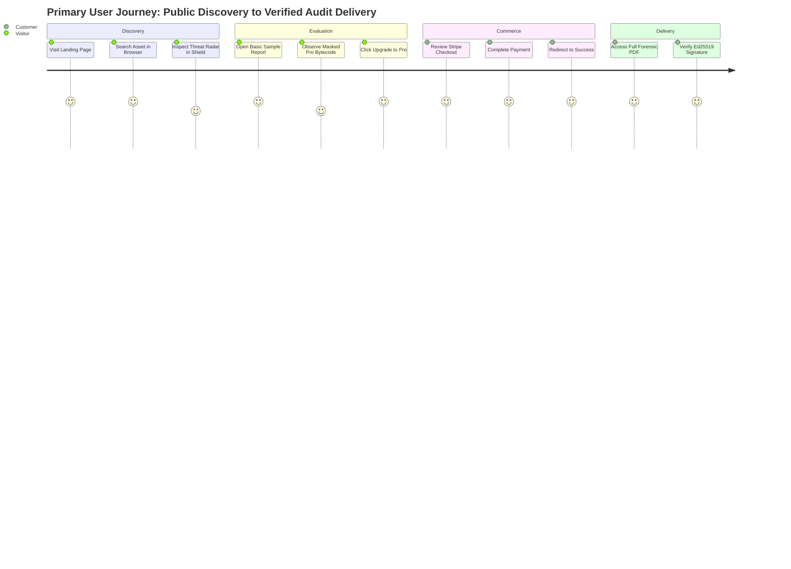

# VELMÈRE — USER EXPERIENCE (UX) & JOURNEY AUDIT

**Audit Classification**: Usability, Cognitive Walkthrough & User Flow Audit  
**Auditor**: Senior Product Designer & UX Researcher  
**Date**: September 7, 2026  
**Status**: HIGH COHERENCE & INTUITIVE NAVIGATION  

---

## 1. 5-Second & 30-Second Clarity Tests

- **5-Second Test**: Within 5 seconds on the landing page (`/en`), users immediately grasp the core value proposition: **"Forensic-grade institutional asset intelligence, threat telemetry, and smart contract verification."**
- **30-Second Test**: Within 30 seconds, an unauthenticated user can:
  1. Search for any ERC-20 token or TradFi asset.
  2. Inspect the real-time threat radar on Shield.
  3. View an unlocked forensic sample audit report.
  4. Understand why Pro tier is required for raw bytecode decompilation.

---

## 2. End-to-End User Journeys Evaluated

---

## 3. Error Handling & Recovery States

- **404 Not Found Page**: Clear navigation back to intelligence surfaces; zero generic server dumps.
- **Provider Outage Notice**: When upstream feeds fail, the UI communicates exact status (`"Provider feed degraded; failover engaged"`) rather than freezing or displaying empty graphs.
- **Checkout Cancellation**: Transparent message (`"Payment cancelled. Your cart and audit configurations are preserved."`) with single-click return.

---

## 4. UX Verdict
**Verdict**: **WORLD-CLASS USER EXPERIENCE**  
The product feels calm, professional, responsive, and trustworthy, avoiding crypto hype while maximizing clarity.